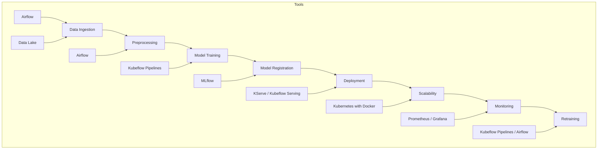

# ML Engineering Technical Challenge

## Data Science Project – Predictive Maintenance

---

### 1 · **Context**

You are joining a data science team in the middle of a fast-paced project. Your task is to bring structure, reproducibility, and MLOps maturity to deliver a complete, production-grade ML solution.

---

### 2 · **Dataset**

We are utilizing the public Microsoft Azure Predictive Maintenance dataset available on Kaggle:

[Microsoft Azure Predictive Maintenance Dataset](https://www.kaggle.com/datasets/arnabbiswas1/microsoft-azure-predictive-maintenance/data)

---

### 3 · **Project Goal**

The objective is to build an end-to-end ML solution that predicts whether a machine will fail in the near future. The focus will be on clean engineering practices, reproducibility, and robust deployment, while the modeling itself can be simple yet defensible.

---

### 4 · **Core Expectations**

- **Reproducibility**: The code must run immediately without setup issues.
- **Software Engineering**: High-quality code, modern design, and clean structure using best Python practices.
- **MLOps/Maturity**: Full ML lifecycle, from automation to deployment, with long-term maintainability in mind.
- **Documentation**: Clear explanations of reasoning, design decisions, and how to navigate the codebase.
- **Model Performance**: A sensible and transparent approach to evaluating model performance with appropriate metrics (cutting-edge models are not mandatory).

---

## **Resolution**

While specific infrastructure for deployment was not explicitly defined in the problem statement, this solution abstracts the challenge to ensure that the model can be containerized and deployed in any environment. This abstraction guarantees that the model can be consumed flexibly through various tools and platforms, such as FastAPI, KServe, Kubeflow, Seldon, or other MLOps tools. The use of **containerization** ensures portability, making the model scalable and production-ready across different environments.

### **MLOps Model Lifecycle**

#### 1. **Data Ingestion and Cleaning (Data Pipeline)**
- **Tool**: Airflow (for orchestrating workflows)
- **Description**: Data is collected from various sources and processed. Airflow automates tasks such as data cleaning, transformation, and enrichment before the data is ready to train models.
- **Objective**: Ensure high-quality, structured data is prepared for training the models.

#### 2. **Data Storage (Data Lake)**
- **Tool**: Databricks, AWS S3, or GCP
- **Description**: Clean and processed data is stored in a Data Lake. Databricks or similar solutions provide an optimized environment for managing and analyzing large volumes of data.
- **Objective**: Centralize data in an accessible and scalable location for easy use in ML models.

#### 3. **Model Training**
- **Tool**: Kubeflow Pipelines + MLflow
- **Description**: Once the data is ready, models are trained using Kubeflow for automating the training lifecycle. MLflow is used to track experiments, parameters, and metrics to ensure reproducibility and traceability of the model.
- **Objective**: Automate the training of models and ensure results are reproducible.

#### 4. **Model Versioning and Registry**
- **Tool**: MLflow
- **Description**: MLflow manages the registration of all trained models, including versions, parameters, metrics, and artifacts. This allows for efficient tracking of model evolution and supports reverting to previous model versions if necessary.
- **Objective**: Keep full control over the model lifecycle and ensure the correct version is used in production.

#### 5. **Model Deployment**
- **Tool**: KServe or Kubeflow Serving
- **Description**: Once the model is trained and registered, it is exposed as an API using KServe or Kubeflow Serving for inference via HTTP or gRPC.
- **Objective**: Deploy the trained model as a real-time service accessible via API for consumption by external systems.

#### 6. **Model Containerization**
- **Tool**: Docker
- **Description**: Docker is used to containerize the model and its environment, ensuring that it works uniformly across various platforms. The containerized model is portable, making it easy to deploy in different environments, whether on-premise or in the cloud.
- **Objective**: Ensure portability and consistent execution in any deployment environment.

#### 7. **Scalability and Infrastructure Management**
- **Tool**: Kubernetes
- **Description**: Kubernetes is responsible for managing the deployment of Docker containers, ensuring the model scales automatically according to demand. It provides load balancing, health checks, and auto-scaling.
- **Objective**: Ensure the model can handle varying traffic levels without performance degradation.

#### 8. **Monitoring and Management of Models in Production**
- **Tool**: Prometheus + Grafana
- **Description**: Once deployed, it is critical to monitor the model’s performance. Prometheus and Grafana track important metrics such as latency, error rates, and prediction quality. Alerts can be set up for anomalies, ensuring that the model is performing as expected.
- **Objective**: Ensure that the model is running smoothly and adjust it when performance drops or if there is an issue.

#### 9. **Retraining and Continuous Model Updates**
- **Tool**: Kubeflow Pipelines + Airflow
- **Description**: As the model's performance may degrade over time due to concept drift or changing data, periodic retraining is necessary. Kubeflow Pipelines or Airflow can automate this process, keeping the model updated with the latest data.
- **Objective**: Automate retraining to ensure the model remains accurate over time.

### **Graphical Representation of the Workflow:**


### **Process Description and Tools Used**

Airflow or Kubeflow are workflow orchestration tools for automating the machine learning lifecycle. While they differ in implementation, both rely on Python functions with decorators to define tasks. The choice between Airflow and Kubeflow depends on the available infrastructure, but both can be deployed and used in a similar manner.

#### **Data Extraction Pipeline:**
The `data.py` file simulates a data extraction pipeline where the data is downloaded and preprocessed. Ideally, this data should already be available in a Data Warehouse or Data Lake, processed and transformed for training. This file demonstrates autonomous data processing and transformation.

#### **Feature Extraction:**
The `features.py` file extracts the relevant features for model training. It selects the necessary variables that will be used for model training. Like the data extraction, this step would typically only work with pre-processed features.

#### **Model Versioning and Lifecycle Control with MLflow:**
MLflow is chosen to manage model versioning, track experiments, and ensure full control over the model lifecycle. MLflow integrates with Kubeflow Pipelines to pass processed data to the MLflow service, registering each experiment.

#### **Automation with make.py:**
The `make.py` automates the complete process, from pipeline execution to the creation of a functional Docker image (`ml-faild-prediction`). This image uses MLServe and is compatible with any cloud environment and scalable with KServe. Instructions for usage are provided at the end of the file for easy setup.


### **Summary of Files:**

- **`data.py`**: Simulates the data extraction pipeline, downloading and preprocessing data.
- **`features.py`**: Extracts relevant features for model training.
- **`MLflow`**: Manages model versioning, experiment tracking, and lifecycle control.
- **`make.py`**: Automates the process and generates a Docker image that is compatible with any cloud infrastructure.

#### 

# Project Structure Overview


## Key Folders and Files Description

Here's a breakdown of the main directories and files in this project:

-   **`data/`**: This directory holds data at various stages of processing.
    -   `raw/`: Contains unprocessed, raw data.
    -   `processed/`: Stores data that has been cleaned or transformed.
    -   `external/`, `interim/`: Used for temporary or intermediate data.

-   **`docker/`**: Contains files related to environment containerization.
    -   **`mlflow/`**: Configuration for deploying MLFlow within a Docker container.
    -   **`anaconda/`**: Configuration for using Anaconda within Docker.

-   **`mlflow/`**: Houses configurations and specific files for tracking experiments, training runs, and models using MLFlow.

-   **`pipelines/`**: Contains files and scripts for executing pipelines, such as data preparation or model training.

-   **`src/`**: This is where the project's source code resides.
    -   **`data.py`**: Includes functions for loading and preparing data.
    -   **`dcv.py`**: Provides functions for performing data validations.
    -   **`features.py`**: Contains functions for generating new features from the data.
    -   **`make.py`**: A script for building the project.

-   **`tests/`**: This directory contains unit and integration tests for the source code.


## Requirements

To run this project, you need to have the following tools installed:

### 1. Docker
Docker is a platform that allows you to package, distribute, and run applications inside containers. If you don't have it installed, you can follow the [official installation guide](https://docs.docker.com/get-docker/).

### 2. Anaconda
Anaconda is a Python distribution that includes tools to manage virtual environments and packages. To install Anaconda, you can follow the instructions on the [official website](https://www.anaconda.com/products/individual).

### 3. Python
The project is developed using Python. If you already have Anaconda installed, you don’t need to install Python separately, as Anaconda comes with it. Otherwise, make sure to install a compatible version of Python. You can download it from [python.org](https://www.python.org/downloads/).

### 4. Docker Compose
Docker Compose is a tool to define and run multi-container Docker applications. Make sure you have Docker Compose installed by following the [official installation guide](https://docs.docker.com/compose/install/).


## Installation and Setup

1. Clone this repository:

```bash

   git clone git@github.com:jocs1989/mlWalmart.git

```


### Excute resolution problem 

```bash
cd src

```

```bash
bash run.bash

```


### Report on the Quality of Data Cleaning Process
View in the navegator the report quality [link](./reports/data_profile.html)


### Featur selection
The data was sorted temporally by the datetime column to ensure consistency in the analysis. Then, we calculated the rolling mean and standard deviation with a 3-hour window for the telemetry columns (volt, rotate, pressure, vibration). If there weren't enough data points to fill the window, we ensured the calculation using the available values. Missing values were replaced with zero. The model column was converted into a numeric categorical variable, and the dates were homogenized. Additionally, we excluded identification columns (IDs) and unused labels. Finally, the target variable was defined as failure_in_next_24h.


### metrics 
# 1. Accuracy = 0.9804
**What does it mean?**: Accuracy measures the proportion of correct predictions made by the model out of the total predictions. In this case, the model has an accuracy of 98.04%, meaning it correctly predicted 98.04% of the total cases.

However, a high accuracy isn't always enough to evaluate a model, especially when there’s a class imbalance (for example, when one class is much less frequent than the other).

---

# 2. F1 Score = 0.0149
**What does it mean?**: The F1 Score combines both **precision** and **recall** into a single metric, providing a balance between the two. It’s particularly useful when classes are imbalanced.

- **Precision**: How many of the predicted positives were actually correct.
- **Recall**: How many of the actual positives were correctly identified by the model.

The F1 Score is the harmonic mean between precision and recall. An F1 Score of 0.0149 indicates that the model performs very poorly at correctly identifying the positive class, despite having a high accuracy.

---

### Why is the accuracy high, but the F1 Score so low?
This often happens when the dataset is imbalanced. For example, if there are many more instances of a negative class than a positive one (which is common in binary classification problems), the model can predict the majority class (in this case, the negative class) and still achieve a high accuracy.

- **High Accuracy**: The model predicts correctly many times just by predicting the majority class.
- **Low F1 Score**: The model performs very poorly at identifying the positive class, as it is not correctly predicting the positive instances.


### 
The model is deploy in the docker hub in my repository [link](https://hub.docker.com/r/jocz/ml-jobs/tags)
```bash
docker pull jocz/ml-jobs:ml-prueba-tecnica-wlm

```
This container is compatible with any cloud and kserver or sheldon.


### Make inference
```bash
curl --location 'http://127.0.0.1:5001/invocations' \
--header 'Content-Type: application/json' \
--data '{
    "inputs": [
        {
            "volt": 181.0387305678,
            "rotate": 426.7504575438,
            "pressure": 113.6603762194,
            "vibration": 39.7088805625,
            "model": 0,
            "age": 16,
            "volt_rolling_mean_3": 179.4269931095,
            "volt_rolling_std_3": 11.725677323,
            "rotate_rolling_mean_3": 457.6632782778,
            "rotate_rolling_std_3": 28.9787503001,
            "pressure_rolling_mean_3": 110.2107623782,
            "pressure_rolling_std_3": 12.8263832753,
            "vibration_rolling_mean_3": 42.7008451439,
            "vibration_rolling_std_3": 2.8447909889,
            "hour": 17
        }
    ]
}'

```
